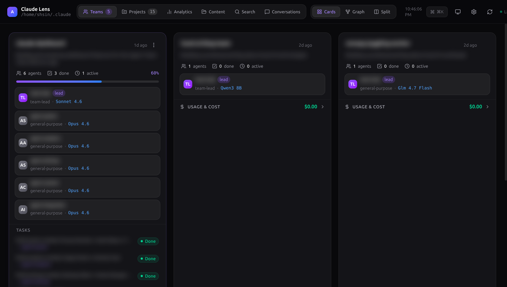
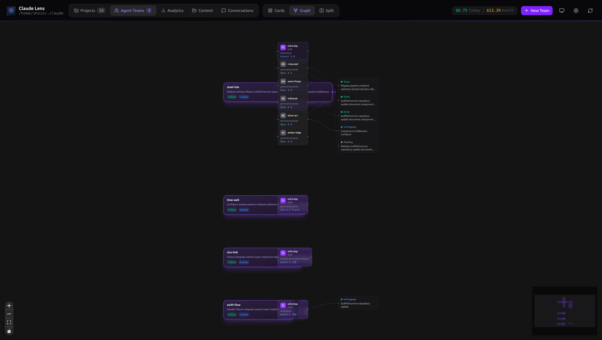
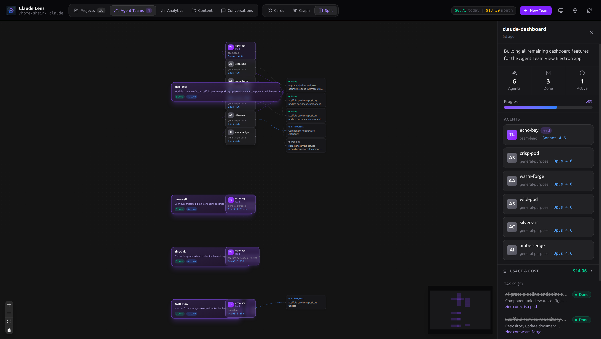
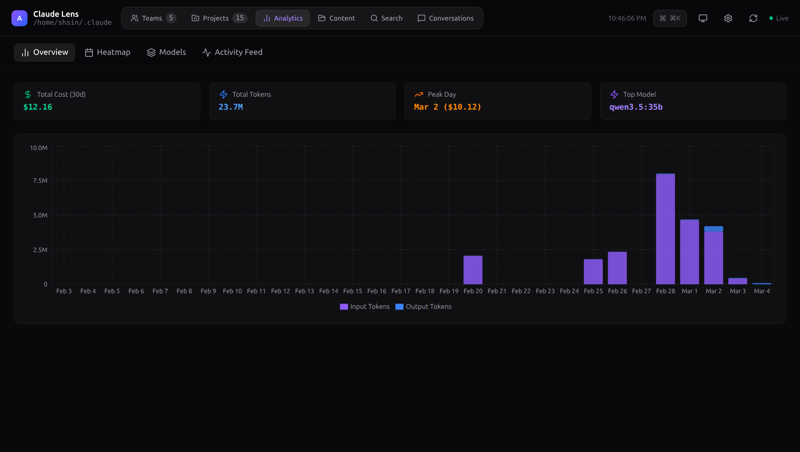
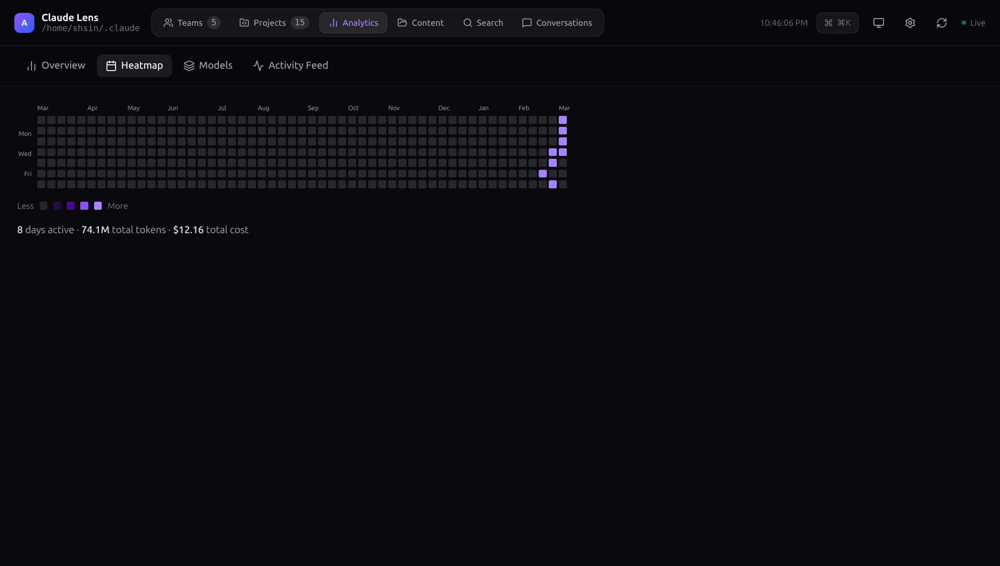
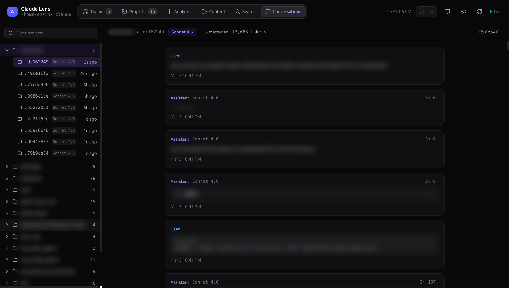

# Claude Lens: The Missing Control Tower for Claude Code Agent Teams

If you're running multi-agent Claude Code sessions — and you should be — you already know the pain. You spin up a team of agents, they scatter across your codebase, tasks start flowing, tokens burn, and you're left staring at terminal output wondering: *What's actually happening? How much is this costing me? Did that task even finish?*

Claude Lens is the answer. It's a native desktop app that turns your `~/.claude/` directory into a real-time observability dashboard. Think of it as the GUI that Claude Code's multi-agent system never shipped with.

I built this because I needed it. And if you're a power user of Claude Code, you probably need it too.

---

## The Problem: Flying Blind with Multi-Agent Teams

Claude Code's team feature is powerful. You can spawn a lead agent, have it create teammates, assign tasks, and coordinate work across your entire codebase. But once that swarm is running, your visibility is essentially:

- Terminal output scrolling past faster than you can read
- Manually `cat`-ing JSON files in `~/.claude/tasks/`
- No idea what your token spend looks like until the bill arrives
- No way to browse past conversations without digging through JSONL files
- No overview of which agents are doing what, or which tasks are blocked

For a single-agent session, this is manageable. For a team of 4-6 agents working in parallel? It's chaos.

Claude Lens gives you a single pane of glass over *everything* — teams, tasks, agents, costs, conversations, analytics, and system health. All updated in real-time via filesystem watchers.

---

## What Claude Lens Actually Does

### Real-Time Team Monitoring (Three Ways to See It)

The core of Claude Lens is the Teams view, and it gives you three distinct layouts depending on how you think:

**Card View** — A responsive grid of team cards. Each card shows the team name, description, agent count, task progress (with a slick gradient progress bar), cost breakdown, and inline task list. At a glance, you know exactly where every team stands.



**Graph View** — This is where it gets interesting. Built on React Flow, the graph view renders your entire team topology as an interactive node graph. Team nodes connect to agent nodes, which connect to task nodes. Edges are color-coded and animated: violet for team-agent relationships, animated blue for in-progress tasks, dashed orange for blocking dependencies. You can zoom, pan, and click to inspect. It's the best way to understand complex dependency chains at a glance.



**Split View** — The pragmatist's layout. Graph on the left, detail panel on the right. Click a team node in the graph and the right side expands with full stats, every agent, the cost panel, and the complete task list.



Each team also has an action menu for operations like archiving (moves to `~/.claude/teams-archive/`), clearing tasks, revealing the team folder in your file manager, or deleting with confirmation.

### Cost Tracking That Actually Works

This was the feature I built first, because I was tired of guessing.

Claude Lens scans every JSONL conversation file in `~/.claude/projects/`, deduplicates messages by ID (Claude Code's streaming writes can produce duplicate records — naively summing them would massively overcount), and calculates USD cost using current Anthropic pricing for every model family:

| Model | Input | Output | Cache Write | Cache Read |
|---|---|---|---|---|
| Claude Opus 4.6 | $15/M | $75/M | $18.75/M | $1.50/M |
| Claude Sonnet 4.6 | $3/M | $15/M | $3.75/M | $0.30/M |
| Claude Haiku 4.5 | $0.80/M | $4/M | $1.00/M | $0.08/M |

Costs are aggregated per team, per project, and per session. The `CostPanel` component on every team card gives you an instant breakdown — no more surprise bills.

### Analytics Dashboard

The Analytics view has four tabs that give you the full picture of your Claude Code usage over time:

**Usage Overview** — A 30-day stacked bar chart (Recharts) showing daily input tokens (violet) and output tokens (blue). Hover for cache token counts and daily cost. Summary cards show total 30-day spend, total tokens, peak usage day, and your most-used model.



**Activity Heatmap** — A GitHub-style contribution calendar spanning 365 days. Five intensity levels based on total tokens, colored in violet. Instantly spot your heavy usage days and usage patterns.



**Model Comparison** — A bar chart breaking down cost by model, plus a summary table with message counts, token breakdowns, and total cost per model. Useful for understanding whether you're getting good value from Opus vs. Sonnet usage.

**Activity Feed** — A reverse-chronological log of all assistant turns across all projects (up to 200). Each entry shows the timestamp, project, team, model, and a message preview. It's like an audit log for your AI usage.

### Conversation Browser

Ever wanted to go back and read what an agent actually said during a session three days ago? The Conversation view makes this trivial.

A collapsible project tree on the left lets you drill into any project and session. The right panel renders the full conversation thread with distinct styling for user messages (blue border) and assistant messages (violet border). Tool use blocks are rendered with expandable JSON inputs. Thinking blocks show as collapsible italic sections. Token counts appear inline on every message.



This alone saves an enormous amount of time compared to manually parsing JSONL files.

### Full-Text Search Across All Sessions

The Search view runs a debounced full-text search across every JSONL session file on disk. Results appear with highlighted match snippets and context. Click any result to jump directly to that session in the Conversation view. It's fast and it works — up to 50 results per query with 150-character contextual snippets around each match.

### Content Management

The Content view gives you five tabs:

- **Plans** — Renders all markdown files from `~/.claude/plans/`
- **Todos** — Shows per-agent todo lists from `~/.claude/todos/` with status indicators
- **Memory** — Browses memory files across all projects and your working directory's `CLAUDE.md`
- **Cleanup** — Lists projects sorted by disk usage with file count, size, and activity dates. Delete button with confirmation to reclaim space from old session files
- **Export** — One-click CSV export of all usage data (date, project, session, team, model, tokens, cost)

### System Monitoring

The System view keeps you informed about your Claude Code environment:

- **Processes** — Live list of running Claude-related processes with CPU%, memory%, PID, and a kill button (sends SIGTERM with confirmation)
- **Auth** — Reads your credentials file and displays subscription type, rate limit tier, expiry, and scopes
- **Telemetry** — Shows recent telemetry events including version info, session IDs, and process resource stats

### Settings & Configuration

Six settings tabs covering everything you'd want to configure:

- **General** — Theme (light/dark/system auto-detection), Claude directory path, auto-refresh interval, effort level, permissions mode
- **Hooks** — View, add, delete, and *test* Claude Code hooks with a "Test Hook" button that executes the command and shows output
- **MCP Servers** — Inspect and edit MCP server configurations (command, args, env vars) directly from the app
- **Profiles** — Save your current settings as named profiles and switch between them
- **Notifications** — Configure desktop notifications for task completions, team creation, and cost threshold alerts. Set per-team and global daily budget limits
- **Templates** — Save any team's configuration as a reusable template for quickly spinning up similar teams later

### Command Palette

`Ctrl+K` / `Cmd+K` opens a command palette overlay with backdrop blur. Every navigation target, team, and project is searchable with fuzzy matching. Keyboard navigation with arrow keys and Enter. It's the fastest way to get anywhere in the app.

---

## How It Works Under the Hood

Claude Lens is a pure **read-mostly companion** to Claude Code. It never interferes with your running agents. Here's the architecture:

### Three-Layer Electron Architecture

**Main Process** (Node.js) — Owns filesystem access, runs the chokidar watcher, performs the JSONL scanning and cost calculations. This is where the heavy data work happens. The scanner does a single-pass read of all JSONL files, deduplicates by message ID (keeping the highest `output_tokens` version for accuracy), computes costs, and caches the result. The cache is intelligently invalidated: team/task changes trigger a 300ms debounce, while project file changes (which require a full re-scan) use a 2000ms debounce to avoid thrashing during active agent sessions.

**Preload Bridge** — A secure context bridge that exposes a typed `window.electronAPI` surface to the renderer. Context isolation is ON, Node integration is OFF. Every filesystem operation goes through this controlled IPC seam.

**React Renderer** — A single-page app with React 19, TypeScript, and Tailwind CSS v4. Data flows through a central `useTeamData` hook that subscribes to IPC push channels for live updates. No polling — the filesystem watcher pushes changes directly to the UI.

### Live Update Pipeline

```
File change in ~/.claude/
  → chokidar detects it
  → debounce (300ms for tasks, 2000ms for projects)
  → main process reads fresh data
  → IPC push to renderer
  → React state update
  → UI re-renders
```

The watcher is configured with `awaitWriteFinish` (500ms stability threshold) to handle Claude Code's streaming writes gracefully. Lock files are ignored. Depth is set to 4 subdirectory levels.

### Desktop Notifications

When the filesystem watcher detects a task status transition to "completed," it fires an Electron native notification with the task subject and owner. You get notified the moment an agent finishes a task, even if the app is in the background.

---

## Tech Stack

| Layer | Technology |
|---|---|
| Runtime | Electron 40 |
| Frontend | React 19, TypeScript, Tailwind CSS v4 |
| Build | Vite 7, electron-builder |
| Charts | Recharts 3 |
| Graph Visualization | @xyflow/react (React Flow) v12 |
| File Watching | chokidar 5 |
| Icons | lucide-react |

Packaging produces native installers: `.dmg` for macOS, NSIS installer for Windows, and AppImage for Linux.

---

## Getting Started

```bash
git clone <repo-url>
cd claude-lens
npm install
npm run dev
```

That's it. The app reads from `~/.claude/` automatically. If you have Claude Code installed and have run any sessions, you'll see data immediately.

For a production build:

```bash
npm run build
```

Output goes to `release/` with platform-appropriate installers.

---

## Who Is This For?

If any of these describe you, Claude Lens will change your workflow:

- **You run multi-agent Claude Code teams** and want visibility into what your agents are doing, in real time
- **You care about cost** and want to know exactly how much each team, project, and session is costing you — down to cache token granularity
- **You want to review conversations** without parsing raw JSONL files by hand
- **You manage multiple Claude Code projects** and want a unified dashboard across all of them
- **You want analytics** on your Claude Code usage patterns over time
- **You configure hooks, MCP servers, or settings** and want a GUI instead of hand-editing JSON

Even if you're a single-agent user, the cost tracking, conversation browser, and analytics views alone make it worth running.

---

## What This Solves

Claude Code is an incredibly powerful tool, but its multi-agent orchestration features produce a lot of state — teams, tasks, conversations, tokens, costs — all stored as files on disk with no native way to visualize or manage them. Claude Lens bridges that gap completely.

It doesn't replace Claude Code. It doesn't interfere with it. It sits alongside it and gives you the observability layer that turns "I think my agents are working" into "I *know* exactly what every agent is doing, what it costs, and what happened."

If you're serious about using Claude Code at scale, this is the missing piece.

---

*Claude Lens is open source under the ISC license. Contributions welcome.*

> **Note:** Screenshots referenced in this post should be captured from a running instance of Claude Lens. To generate them, run `npm run dev` with active Claude Code team data in your `~/.claude/` directory.
