# Claude Lens

The control tower for Claude Code's multi-agent system. A native desktop app that turns your `~/.claude/` directory into a real-time observability dashboard — teams, costs, conversations, analytics, and system health in one window.

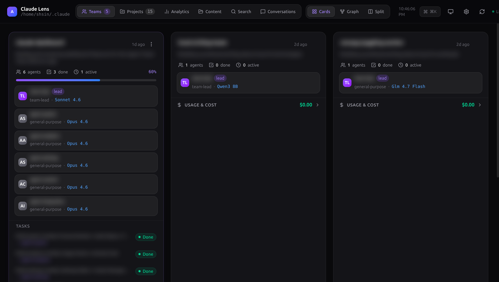

## The Problem

Claude Code's agent teams are powerful, but once a swarm is running you're left with:

- Terminal output scrolling past faster than you can read
- Manually `cat`-ing JSON task files to check status
- No cost visibility until the API bill arrives
- No way to browse past conversations without parsing `.jsonl` files

Claude Lens fixes all of that.

## Features

### Team Monitoring

Three layouts for watching your agent swarm in real time:

**Card View** — A responsive grid with progress bars, agent counts, model badges, task lists, and live cost per team.


**Graph View** — Interactive node graph of your team topology powered by React Flow. Violet edges for team-agent links, animated pulses for in-progress tasks, dashed orange for blocking dependencies.


**Split View** — Graph on the left, detail panel on the right.


- Create teams from the UI — no terminal required
- Per-team actions: delete, archive, clear tasks, reveal in Finder/Files, copy name
- Real-time filesystem watcher pushes updates without manual refresh

### Projects

Every Claude Code project on your machine as a card — session count, total spend, models used, linked teams. Sort by recency, cost, or tokens.

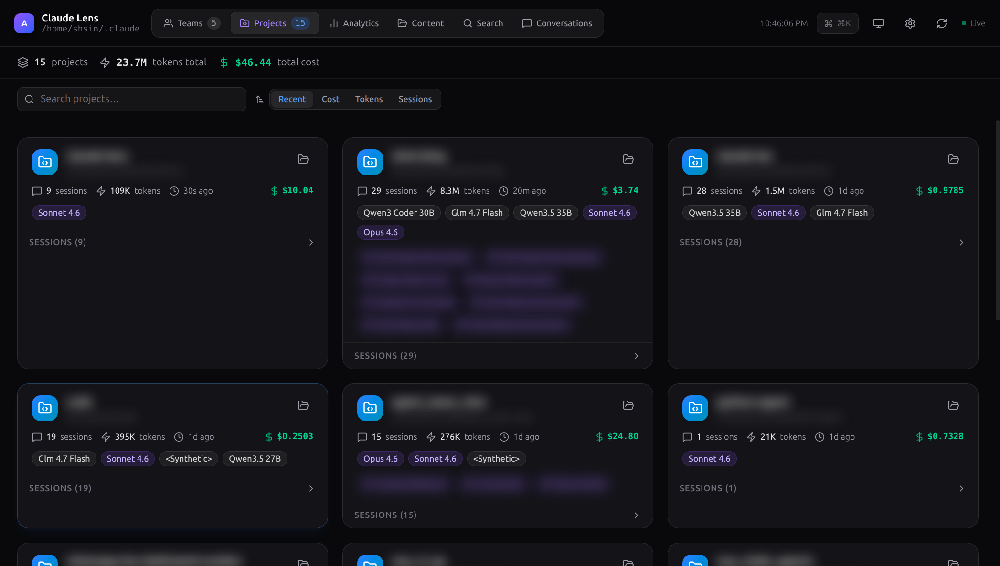

### Analytics

Five tabs of usage insight, lazy-loaded and auto-refreshing every 30s (paused when the window is hidden):

**Overview** — Stacked bar chart of daily tokens and cost (7d / 30d / 90d). Top Projects by Cost ranking.


**Heatmap** — GitHub-style 365-day activity calendar.


**Models** — Per-model breakdown of messages, tokens, cache utilization, and cost.

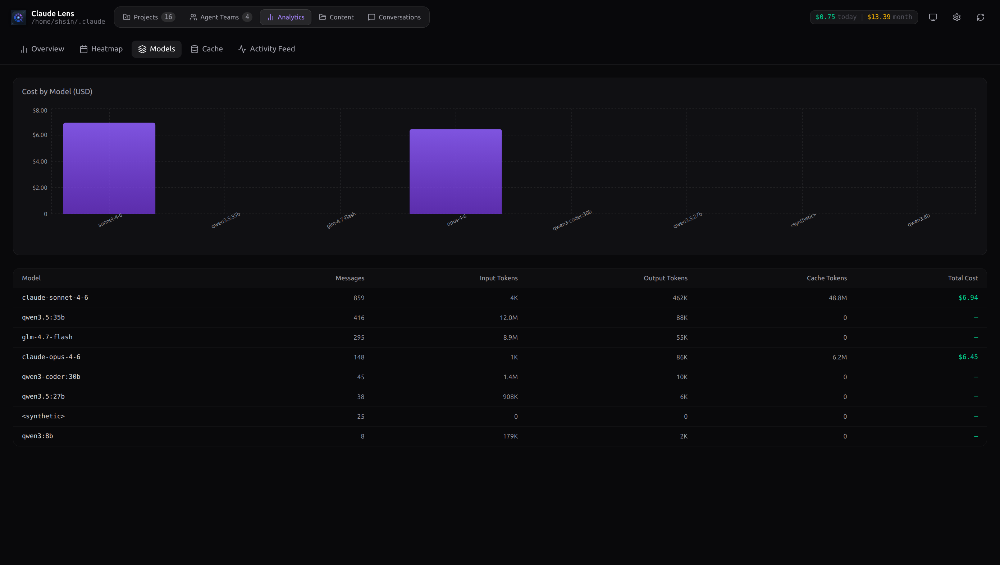

**Cache** — Hit rate, total savings in USD, and daily cache read vs. write chart.

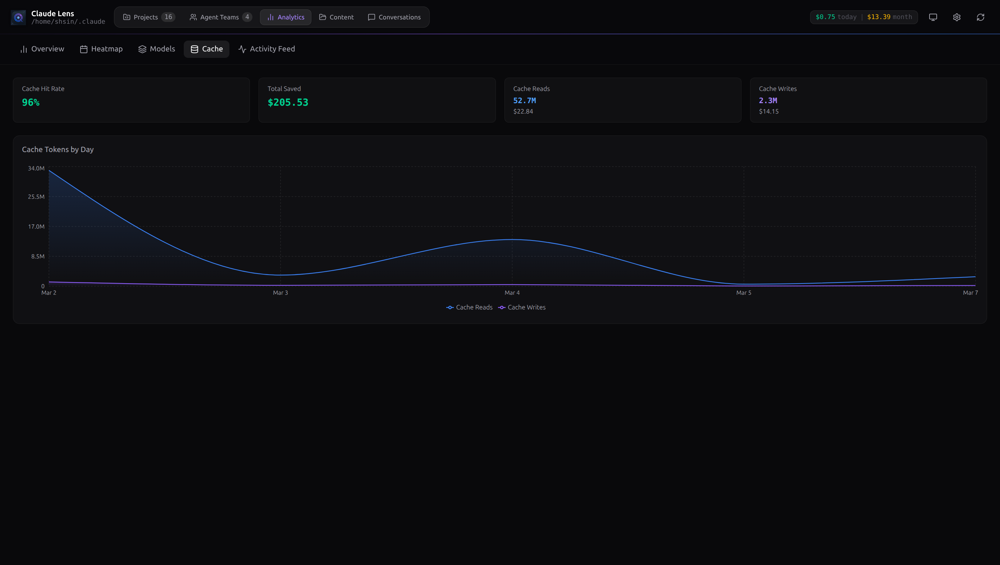

**Activity Feed** — Reverse-chronological log of all assistant turns with timestamps, projects, and message previews.

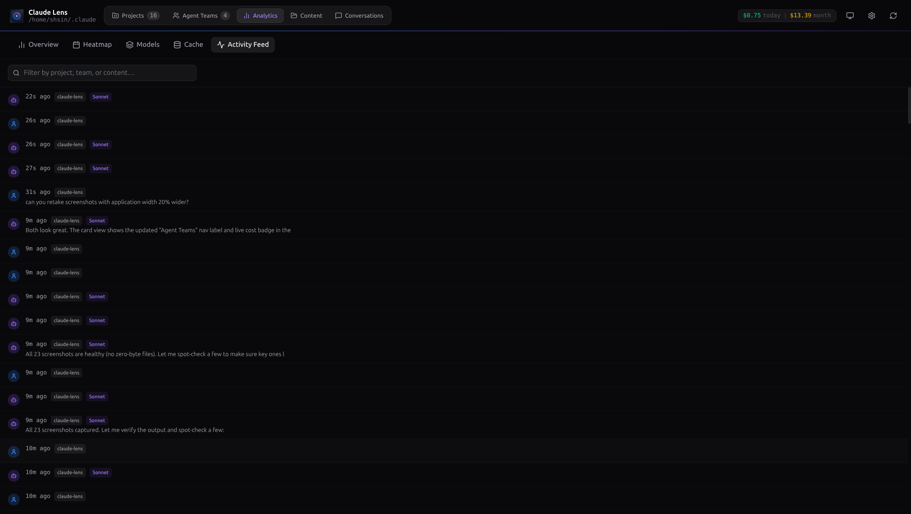

### Conversation Browser

Collapsible project tree with full conversation rendering — user/assistant bubbles, expandable tool-use blocks, inline token counts, and per-session cost in the sidebar.


- **Ctrl+F** search with match highlighting across the entire thread
- **Export as Markdown** — one-click `.md` download of any session

### Full-Text Search

Debounced search across every JSONL session file on disk. Highlighted snippets, click-to-jump.

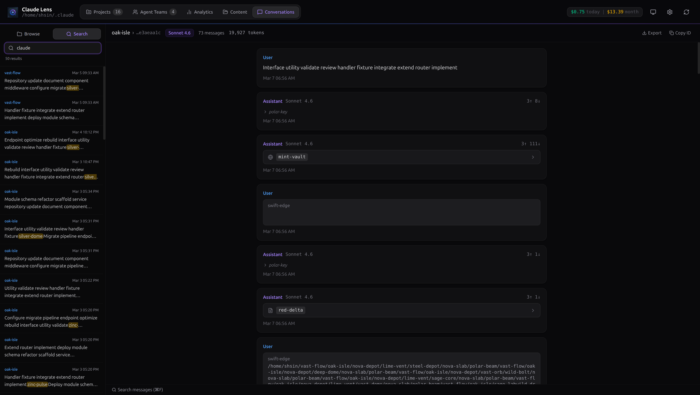

### Content

Browse Claude Code's internal state — memory files, active plans, todo lists, and project disk usage with one-click cleanup.

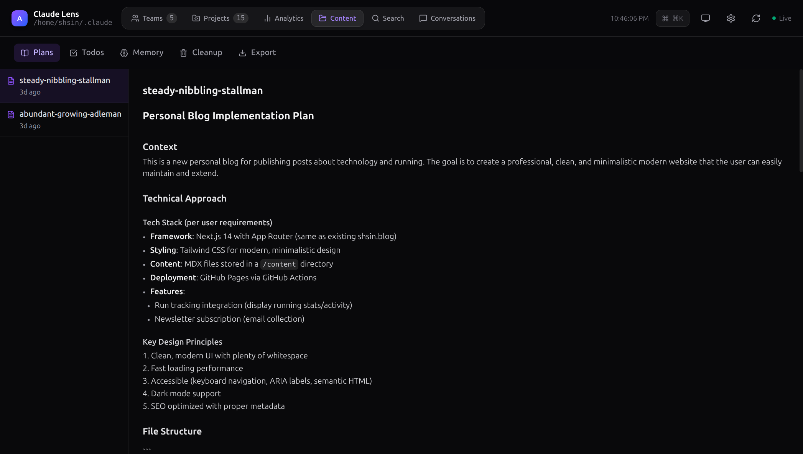

### Settings GUI

A full interface over `~/.claude/settings.json` — no text editor required.

**General** — Effort level, permission mode, environment variables, status line command.

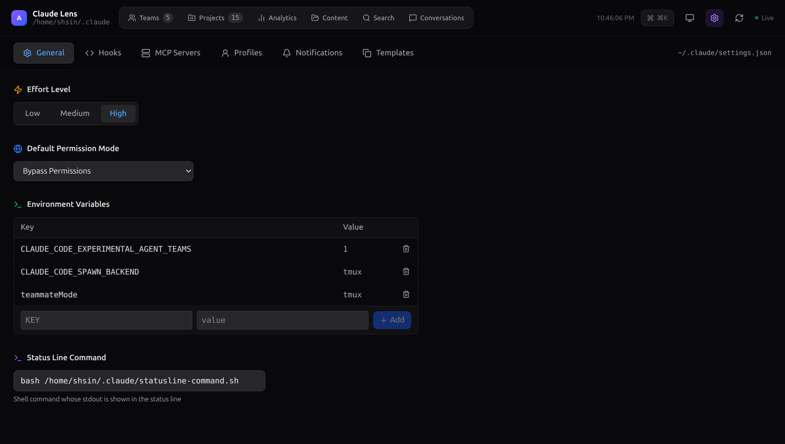

**Hooks** — Manage Pre/Post tool-use hooks with an inline test runner. Click play, see stdout/stderr and exit codes live.

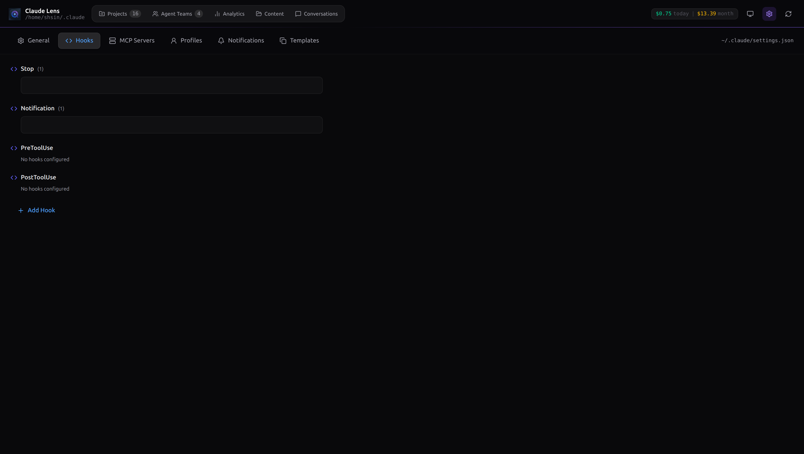

**MCP Servers** — Add and configure servers with a clean form.

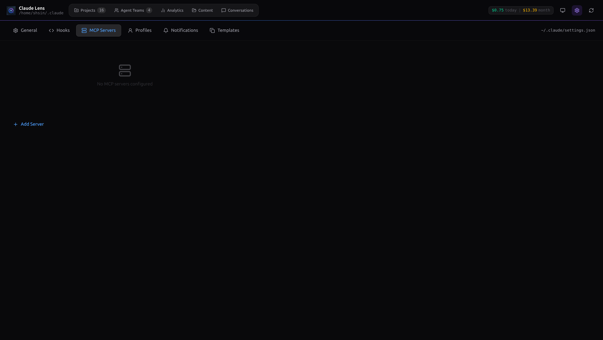

**Notifications & Budget** — Desktop notifications for task completions and team creation. Budget limits with soft warnings and hard alerts.

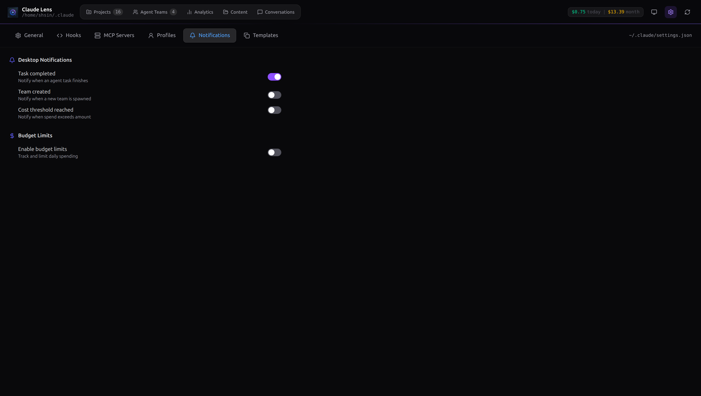

**Profiles & Templates** — Snapshot settings or save team topologies as reusable templates.

### System

Live process table of all `claude` sessions with CPU%, memory%, elapsed time, and **CPU sparklines** (rolling 60s history). One-click kill for hung sessions.

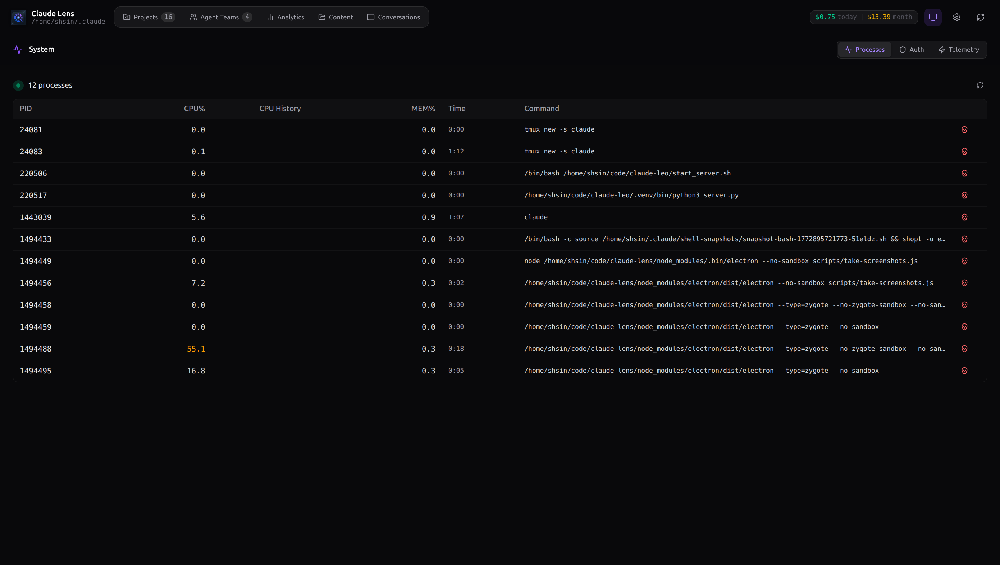

Auth monitoring with token expiry badges. Telemetry event browser.

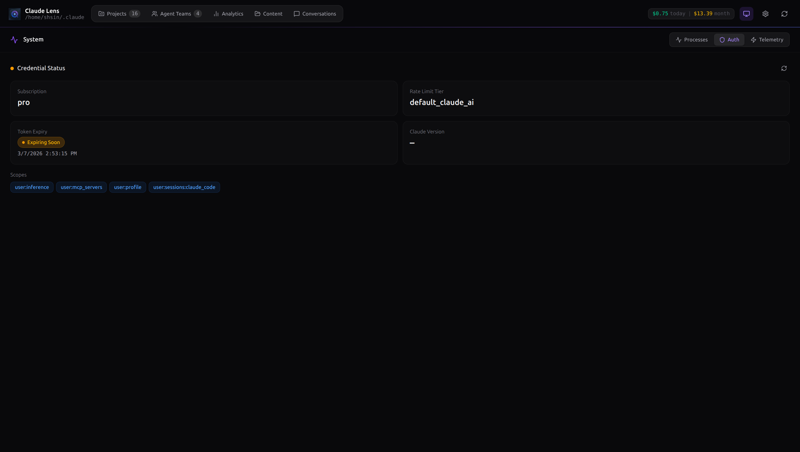

### Command Palette & Keyboard Shortcuts

`Ctrl+K` / `Cmd+K` opens fuzzy-matched navigation to any view, team, or project.

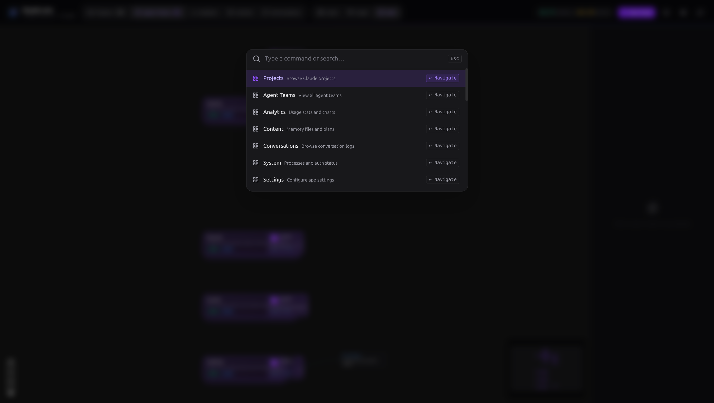

| Shortcut | Action |
|---|---|
| `1` – `8` | Jump to view |
| `r` | Refresh data |
| `Ctrl+K` / `Cmd+K` | Command palette |
| `Ctrl+F` | Search current conversation |
| `Escape` | Close palette / modal |

## How It Works

Claude Lens is a **read-mostly companion**. It never modifies your conversation history or interferes with running agents.

A Node.js main process watches the filesystem with `chokidar`, handles JSONL scanning and deduplication, and pushes updates via IPC to the React frontend. Write operations (team creation, settings changes, process kills) are only triggered by explicit user action.

### Data Sources

| Path | What it reads |
|---|---|
| `~/.claude/teams/*/config.json` | Team metadata and member list |
| `~/.claude/tasks/*/` | Task JSON files per team |
| `~/.claude/projects/*/` | Session JSONL files (conversations + usage) |
| `~/.claude/settings.json` | Claude Code settings |
| `~/.claude/settings.local.json` | Local settings overrides |

## Tech Stack

| Layer | Technology |
|---|---|
| Runtime | Electron 40 |
| Frontend | React 19, TypeScript, Tailwind CSS v4 |
| Build | Vite 7, electron-builder |
| Charts | Recharts 3 |
| Graph | @xyflow/react (React Flow) v12 |
| File Watching | chokidar 5 |
| Icons | lucide-react |

## Quick Start

```bash
gh repo clone shansin/claude-lens
cd claude-lens
npm install
npm run dev
```

If you've used Claude Code before, the dashboard is live immediately with your data.

### Production Build

```bash
npm run build
```

Output goes to `release/`.

| Platform | Format |
|---|---|
| macOS | `.dmg` |
| Windows | NSIS installer |
| Linux | `AppImage` |

### Screenshots & Recording

```bash
npm run screenshots    # Captures PNGs of each view into screenshots/
npm run record         # Records an MP4 session (requires ffmpeg)
```

## Project Structure

```
claude-lens/
├── electron/
│   ├── main.ts            # Main process, IPC handlers, file watcher, cost scanner
│   ├── preload.ts         # Context bridge (renderer ↔ main)
│   └── modules/           # analytics, content, metrics, notifications, settings, system, viewer
├── src/
│   ├── App.tsx            # Root layout, view routing, command palette, CreateTeam modal
│   ├── components/views/  # Top-level views
│   ├── components/*.tsx   # Shared components
│   ├── hooks/useTeamData.ts # Main data hook
│   └── types.ts           # Shared TypeScript types
├── scripts/               # Screenshot & recording automation
└── package.json
```

## Prerequisites

- Node.js 18+
- npm 9+

## License

ISC
